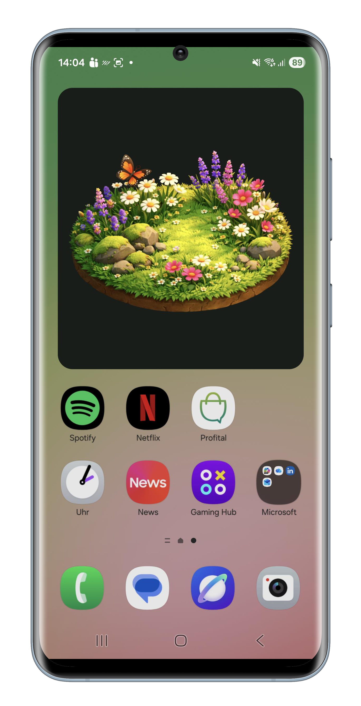

# Digital Footprint Explorer (DFE) 🌿📱

> **Make the invisible environmental impacts of your digital activities visible.**

The **Digital Footprint Explorer (DFE)** is a mobile application developed at the **Zurich University of Applied Sciences (ZHAW)**. It translates unseen digital resource consumption—such as data streaming, messaging, social media usage, and AI processing—into intuitive, emotionally engaging eco-feedback.

---

## 📌 Overview

While modern digital activities feel virtual and weightless, they rely on energy-intensive infrastructure: data centers, network transmission lines, and device manufacturing. DFE addresses this disconnect by transforming abstract mobile data metrics into a tangible metaphor: **a living virtual garden**.

* **Flourishing State:** When your digital footprint remains low, your garden thrives with vibrant plants.
* **Deteriorating State:** High data-intensive consumption (such as high-definition video streaming) gradually degrades the virtual environment.

---

## ✨ Key Features

- **🌱 Virtual Eco-System Metaphor:** Real-time visual feedback represented via a dynamic virtual garden and desktop widget.
- **📊 Activity Classification:** Tracks and categorizes data usage from common mobile activities.
- **💡 Educational Insights:** Learn how manufacturing, data transport, and server energy contribute to overall $\text{CO}_2\text{e}$ emissions.
- **🔒 Privacy-First Architecture:** Local data processing ensures mobile network tracking stays strictly on your device.

---

## 🔒 Privacy & Data Safety
The Digital Footprint Explorer respects user privacy:
- No personal usage data, browsing history, or message content is inspected or stored outside your local device.
- Network traffic statistics are read exclusively at the aggregate system layer to compute the visual representation.

--

## 🤝 Contributing
Contributions are welcome! If you would like to submit bug fixes, feature requests, or scientific improvements:
1. Fork the Project.
2. Create your Feature Branch (git checkout -b feature/AmazingFeature).
3. Commit your Changes (git commit -m 'Add some AmazingFeature').
4. Push to the Branch (git push origin feature/AmazingFeature).
5. Open a Pull Request.